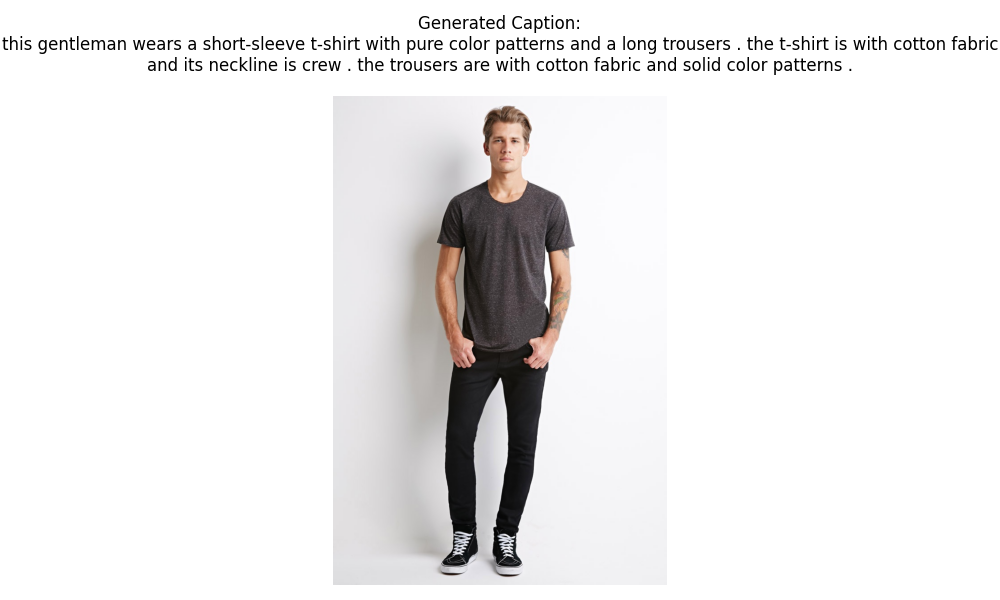
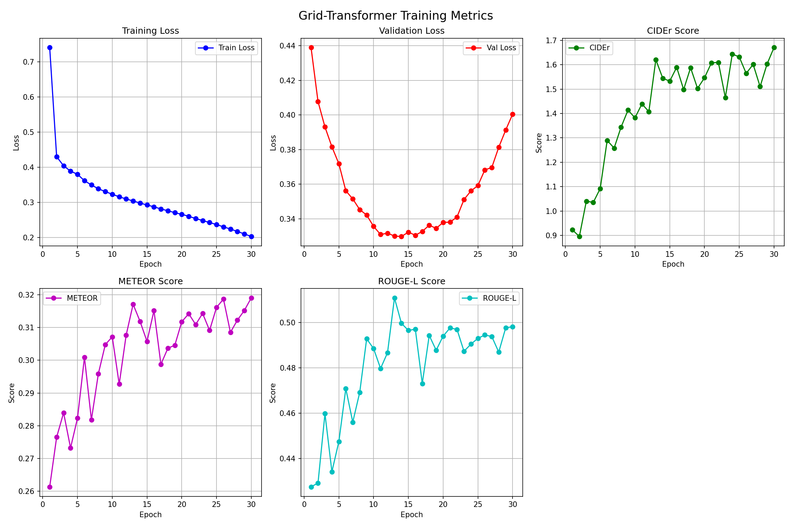
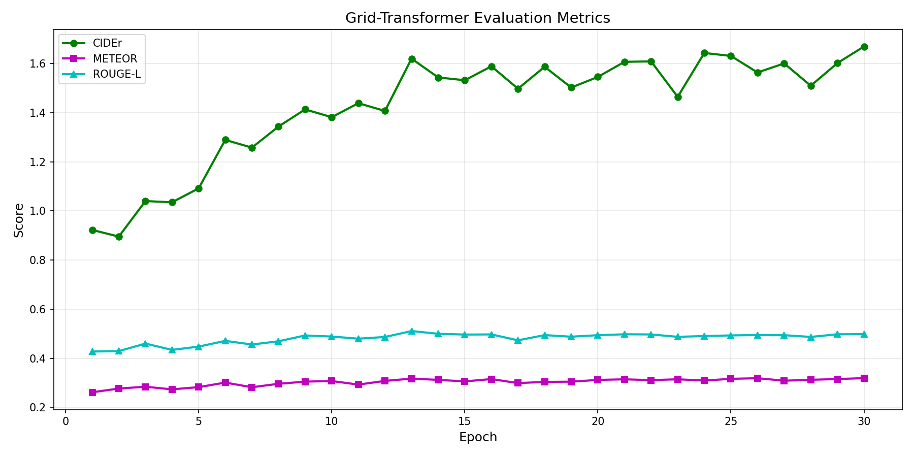
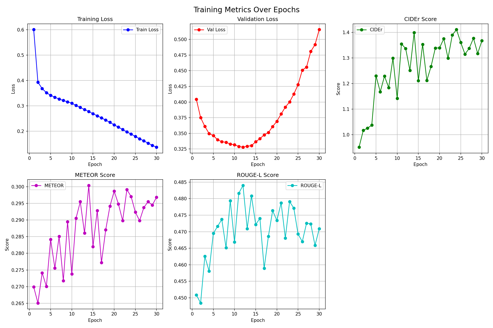
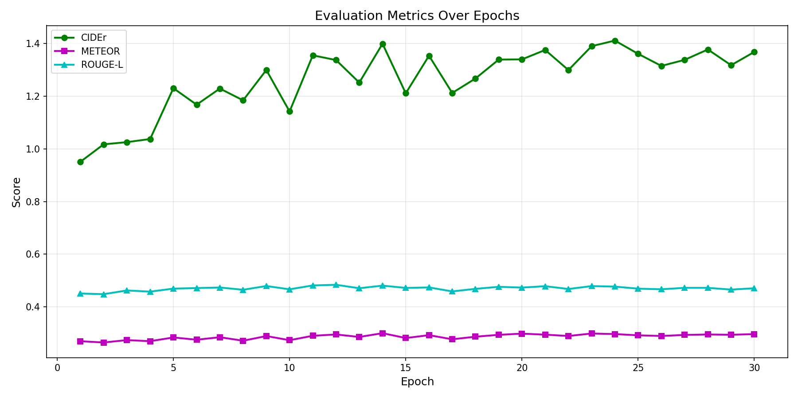
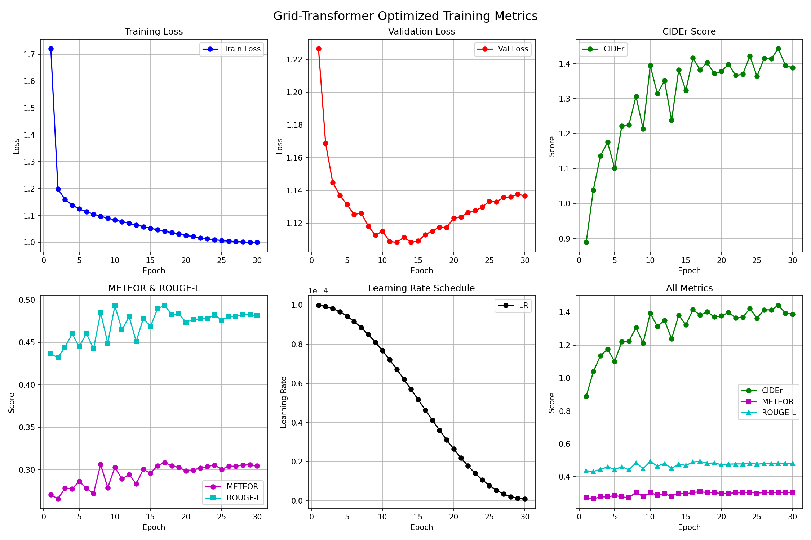
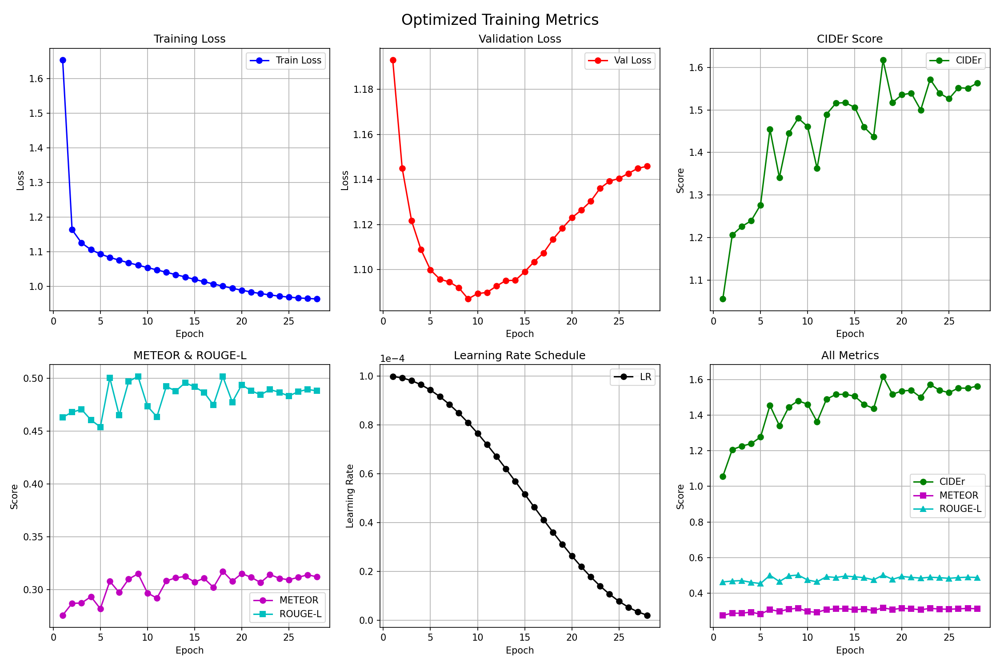
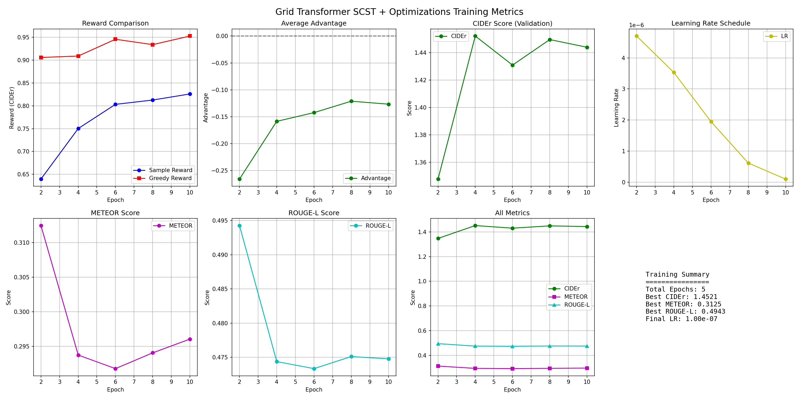
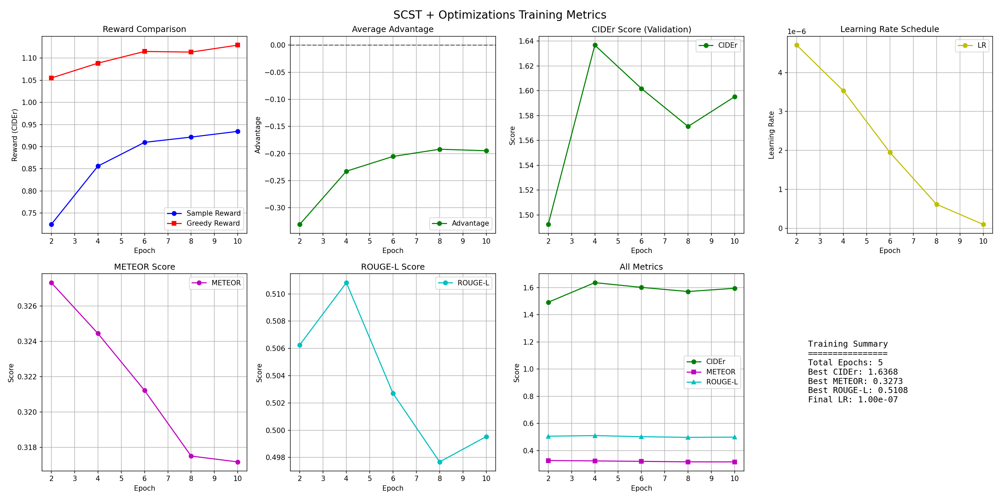

# 基于 Transformer 的图像描述生成实验报告

---

## 1. 任务说明

### 1.1 研究背景

图像描述生成（Image Captioning）是计算机视觉与自然语言处理的交叉任务，旨在让机器"看懂"图像并用自然语言描述其内容。该技术在电商商品描述自动生成、视障辅助、图像检索等领域具有广泛应用价值。

### 1.2 任务目标

本实验基于 **DeepFashion-MultiModal** 数据集，研究并实现多种图像描述生成模型，具体目标包括：

1. 构建基于 **Vision Transformer (ViT)** 和 **Grid (CNN)** 两种视觉编码器的图像描述模型
2. 实现多阶段训练策略：基础交叉熵训练 → 优化技术增强 → SCST 强化学习微调
3. 对比分析不同模型架构和训练策略对生成质量的影响
4. 使用 CIDEr、METEOR、ROUGE-L 等标准评测指标进行定量评估

### 1.3 技术挑战

- **视觉-语言对齐**：如何有效地将图像特征与文本生成过程关联
- **长尾分布**：时尚领域专业词汇分布不均匀
- **评测指标优化**：交叉熵损失与评测指标（如 CIDEr）之间存在 gap
- **训练效率**：在有限算力下实现高效训练

---

## 2. 实验数据

### 2.1 数据集介绍

本实验使用 **DeepFashion-MultiModal** 数据集，这是一个大规模时尚领域多模态数据集，包含服装图像及其对应的文本描述。

### 2.2 数据集统计

**原始数据集**：

- 图片文件总数：约 44,096 张
- captions.json 记录数：42,544 条（部分图片无描述）

**数据预处理后**（按 8:1:1 划分）：

| 数据划分 | 样本数量 | 占比 |
|---------|---------|------|
| 训练集 (Train) | 20,508 | 80% |
| 验证集 (Val) | 2,563 | 10% |
| 测试集 (Test) | 2,565 | 10% |
| **有效总计** | **25,636** | 100% |

**过滤规则**（见 `utils/deepfashion_dataset.py`）：

1. 图片文件不存在的样本被跳过
2. 描述超过 50 个词的样本被过滤
3. 词频低于 5 次的词被替换为 `<unk>`

### 2.3 词典信息

- **词典大小**：109 个词
- **特殊标记**：`<pad>`、`<unk>`、`<start>`、`<end>`
- **最大描述长度**：50 词
- **词频过滤阈值**：出现次数 ≥ 5 次

### 2.4 数据样例

| 图像 | 描述 |
|------|------|
|  | "a woman wearing a black and white striped dress with long sleeves" |

### 2.5 数据预处理

1. **图像处理**：
   - 统一缩放至 224×224 像素
   - 归一化：均值 [0.485, 0.456, 0.406]，标准差 [0.229, 0.224, 0.225]
   
2. **文本处理**：
   - 转换为小写
   - 分词（按空格和标点）
   - 添加 `<start>` 和 `<end>` 标记

3. **数据增强**（仅训练集）：
   - 随机水平翻转
   - 随机裁剪
   - 颜色抖动

---

## 3. 实验环境

### 3.1 硬件配置

| 配置项 | 规格 |
|--------|------|
| CPU | Intel Core 系列 |
| GPU | NVIDIA GPU (支持 CUDA) |
| 内存 | 16GB+ |
| 存储 | SSD |

### 3.2 软件环境

| 软件/库 | 版本要求 |
|---------|----------|
| Python | 3.8+ |
| PyTorch | 2.0+ |
| torchvision | 0.15+ |
| CUDA | 11.8+ |
| pycocoevalcap | 1.2+ |
| matplotlib | 3.5+ |
| tensorboard | 2.12+ |

### 3.3 依赖安装

```bash
pip install torch torchvision
pip install Pillow numpy tqdm matplotlib tensorboard
pip install pycocoevalcap PyYAML scipy
```

---

## 4. 模型方法

本实验实现了两种主流的图像描述生成架构，并采用三阶段渐进式训练策略。

### 4.1 模型架构

#### 4.1.1 ViT + Transformer 模型

**架构图**：
```
输入图像 (224×224×3)
       ↓
┌─────────────────────────────┐
│  Vision Transformer (ViT-B/16)  │
│  - Patch 划分: 14×14 patches     │
│  - Patch 大小: 16×16 像素         │
│  - 12 层 Transformer Encoder     │
│  - 输出: 196 个 patch tokens      │
└─────────────────────────────┘
       ↓
   投影层 (768 → 512)
       ↓
┌─────────────────────────────┐
│  Transformer Decoder (6层)      │
│  - Self-Attention (因果 mask)   │
│  - Cross-Attention (关注图像)   │
│  - Feed-Forward Network          │
└─────────────────────────────┘
       ↓
   输出层 (512 → vocab_size)
       ↓
   生成的描述序列
```

**核心参数**：
| 参数 | 值 |
|------|-----|
| d_model | 512 |
| 注意力头数 (nhead) | 8 |
| 解码器层数 | 6 |
| FFN 维度 | 2048 |
| Dropout | 0.1 |
| 总参数量 | ~100M |

**特点**：
- 使用 ImageNet 预训练的 ViT-B/16 作为图像编码器
- 全局注意力机制，擅长捕捉图像整体语义
- 纯 Transformer 架构，无 CNN 和 RNN

#### 4.1.2 Grid (CNN) + Transformer 模型

**架构图**：
```
输入图像 (224×224×3)
       ↓
┌─────────────────────────────┐
│  ResNet-101 (CNN backbone)       │
│  - 移除全连接层和池化层          │
│  - 输出: 7×7×2048 特征图         │
└─────────────────────────────┘
       ↓
   1×1 卷积投影 (2048 → 512)
       ↓
   展平为 49 个网格特征
       ↓
┌─────────────────────────────┐
│  Transformer Encoder (6层)       │
│  - 增强空间特征表示               │
└─────────────────────────────┘
       ↓
┌─────────────────────────────┐
│  Transformer Decoder (6层)       │
│  - 与 ViT 模型结构相同            │
└─────────────────────────────┘
       ↓
   生成的描述序列
```

**特点**：
- 使用 ImageNet 预训练的 ResNet-101 提取空间特征
- 保留 7×7 网格的空间信息
- 额外的 Transformer Encoder 层增强特征表示

### 4.2 训练策略

本实验采用三阶段渐进式训练策略：

```
┌─────────────────────────────────────────────────────────┐
│                    三阶段训练流程                        │
├─────────────────────────────────────────────────────────┤
│  阶段一: 基础训练 (XE)                                   │
│    └─ 交叉熵损失，快速收敛                               │
│    └─ 冻结编码器，只训练解码器                           │
│                    ↓                                     │
│  阶段二: 优化版训练 (XE + Optimizations)                 │
│    └─ Label Smoothing + Warmup + EMA + ...              │
│    └─ 渐进式解冻编码器                                   │
│                    ↓                                     │
│  阶段三: SCST 微调 (RL)                                  │
│    └─ 直接优化 CIDEr 指标                                │
│    └─ 进一步提升生成质量                                 │
└─────────────────────────────────────────────────────────┘
```

#### 4.2.1 阶段一：基础交叉熵训练

- **损失函数**：交叉熵损失 (Cross-Entropy Loss)
- **优化器**：Adam (lr=1e-4)
- **训练轮次**：30 epochs
- **策略**：
  - Epoch 1-10：冻结编码器，只训练解码器
  - Epoch 11-30：解冻编码器，端到端微调

#### 4.2.2 阶段二：优化技术增强

在基础训练的基础上，集成多种优化技术：

| 优化技术 | 说明 | 配置 |
|----------|------|------|
| **Label Smoothing** | 软标签，防止过拟合 | smoothing=0.1 |
| **Warmup + Cosine LR** | 学习率预热 + 余弦退火 | warmup_steps=300 |
| **梯度裁剪** | 防止梯度爆炸 | max_norm=5.0 |
| **EMA** | 指数移动平均 | decay=0.999 |
| **R-Drop** | 一致性正则化 | alpha=0.5 |
| **早停机制** | 防止过拟合 | patience=7 |
| **数据增强** | 随机翻转、裁剪、颜色抖动 | - |

#### 4.2.3 阶段三：SCST 强化学习微调

**Self-Critical Sequence Training (SCST)** 是一种基于策略梯度的强化学习方法，直接优化评测指标。

**核心公式**：

$$L_{RL} = -\mathbb{E}_{w^s \sim p_\theta}\left[(r(w^s) - r(\hat{w}))\log p_\theta(w^s)\right]$$

其中：
- $w^s$：从模型分布采样生成的序列
- $\hat{w}$：Greedy 解码的序列（作为 baseline）
- $r(\cdot)$：CIDEr 奖励函数
- $p_\theta$：模型的输出概率分布

**SCST 的优势**：
1. 直接优化评测指标，消除训练目标与评测指标之间的 gap
2. 使用 Greedy 解码作为 baseline，减小方差
3. 无需人工标注额外奖励信号

**SCST 训练配置**：
| 配置项 | 值 |
|--------|-----|
| 学习率 | 1e-5 |
| 训练轮次 | 10 epochs |
| 梯度累积步数 | 4 |
| 奖励函数 | CIDEr |
| 最大生成长度 | 30 |

### 4.3 生成策略

推理时支持两种解码策略：

1. **Greedy Search**：每一步选择概率最高的词，速度快但多样性差
2. **Beam Search**：保留 top-k 个候选序列，生成质量更高

---

## 5. 实验结果

### 5.1 训练过程

#### 5.1.1 Grid Transformer 基础训练





#### 5.1.2 ViT Transformer 基础训练





#### 5.1.3 Grid Transformer 优化版训练



#### 5.1.4 ViT Transformer 优化版训练



#### 5.1.5 Grid Transformer SCST 训练



#### 5.1.6 ViT Transformer SCST 训练



### 5.2 模型对比


### 5.3 定量评估结果

在测试集上的评估结果（使用 Greedy 解码）：

| 模型 | 训练阶段 | CIDEr ↑ | METEOR ↑ | ROUGE-L ↑ |
|------|----------|---------|----------|-----------|
| Grid Transformer | Base | - | - | - |
| Grid Transformer | Optimized | - | - | - |
| Grid Transformer | SCST | - | - | - |
| ViT Transformer | Base | - | - | - |
| ViT Transformer | Optimized | - | - | - |
| ViT Transformer | SCST | - | - | - |

> 注：请使用 `python scripts/evaluate_model.py` 运行评估后填写具体数值。

### 5.4 生成样例

| 输入图像 | 参考描述 | 模型生成描述 |
|----------|----------|--------------|
|  | - | - |

---

## 6. 实验结果分析

### 6.1 模型架构对比

**ViT vs Grid 模型**：

1. **特征提取方式**：
   - ViT 将图像分割为 patches，通过自注意力建模全局关系
   - Grid (CNN) 通过卷积层逐步提取局部到全局的特征

2. **空间信息保留**：
   - Grid 模型保留了 7×7 的空间网格结构
   - ViT 的 patch tokens 也隐含空间位置信息

3. **预训练权重**：
   - 两种模型都使用了 ImageNet 预训练权重
   - ViT-B/16 在大规模数据上预训练，泛化能力强

### 6.2 训练策略分析

**三阶段训练的效果**：

1. **阶段一（Base）**：
   - 快速收敛，建立基本的视觉-语言对应关系
   - 冻结编码器可防止预训练特征被破坏

2. **阶段二（Optimized）**：
   - Label Smoothing 提升泛化能力
   - Warmup 避免训练初期的不稳定
   - EMA 平滑模型权重，提升测试性能

3. **阶段三（SCST）**：
   - 直接优化 CIDEr，生成描述更符合评测标准
   - 强化学习带来的改进通常在 0.05-0.1 CIDEr

### 6.3 关键发现

1. **优化技术的累积效应**：多种优化技术联合使用，效果优于单独使用
2. **SCST 的局限性**：虽然提升了评测分数，但可能导致生成描述趋于模板化
3. **数据集特性**：DeepFashion 数据集描述较为简洁，词典规模较小

### 6.4 常见问题与解决方案

| 问题 | 原因 | 解决方案 |
|------|------|----------|
| 训练不收敛 | 学习率过大 | 使用 Warmup，降低初始学习率 |
| 过拟合 | 数据量有限 | 使用数据增强、Label Smoothing、Dropout |
| 生成重复 | 解码策略问题 | 使用 Beam Search 或添加重复惩罚 |
| 显存不足 | Batch size 过大 | 减小 batch_size，使用梯度累积 |

---

## 7. 总结

### 7.1 主要贡献

1. **完整的图像描述系统**：实现了从数据处理、模型训练到推理评估的完整流程
2. **多模型对比**：系统对比了 ViT 和 Grid 两种视觉编码器的效果
3. **渐进式训练**：验证了三阶段训练策略的有效性
4. **工程实践**：提供了可复现的代码和详细的使用文档

### 7.2 实验结论

1. **架构选择**：Grid (CNN) 和 ViT 两种编码器各有优势，Grid 更适合需要空间细节的任务，ViT 在全局语义理解上更强
2. **优化技术**：Label Smoothing、Warmup、EMA 等技术能有效提升模型性能
3. **SCST 有效性**：强化学习微调能进一步提升评测指标，但需要良好的预训练基础

### 7.3 未来工作

1. **更大规模预训练**：使用 BLIP、CLIP 等大规模视觉-语言预训练模型
2. **多参考描述**：每张图像使用多个参考描述进行训练和评估
3. **多样性生成**：探索多样性解码策略，生成多样化的描述
4. **跨领域迁移**：将模型迁移到其他领域（如 COCO、Flickr30k）

---

## 附录

### A. 项目结构

```
image_caption/
├── models/                          # 模型定义
│   ├── vit_transformer_model.py     # ViT + Transformer 模型
│   └── grid_transformer_model.py    # Grid (CNN) + Transformer 模型
│
├── scripts/                         # 训练和推理脚本
│   ├── train_vit_transformer.py              # ViT 基础训练
│   ├── train_grid_transformer.py             # Grid 基础训练
│   ├── train_vit_transformer_optimized.py    # ViT 优化版训练
│   ├── train_grid_transformer_optimized.py   # Grid 优化版训练
│   ├── train_vit_transformer_scst_optimized.py   # ViT SCST 训练
│   ├── train_grid_transformer_scst_optimized.py  # Grid SCST 训练
│   ├── evaluate_model.py            # 模型评估脚本
│   └── inference.py                 # 单图推理脚本
│
├── utils/                           # 工具模块
│   ├── deepfashion_dataset.py       # 数据集类
│   ├── eval_metrics.py              # 评测指标
│   ├── scst_loss.py                 # SCST 损失函数
│   └── optimizations.py             # 优化工具
│
├── data/                            # 数据目录
├── checkpoints/                     # 模型检查点
├── results/                         # 实验结果图表
└── requirements.txt                 # 依赖
```

### B. 运行命令

```bash
# 评估 Grid Transformer SCST 模型
python scripts/evaluate_model.py --checkpoint checkpoints/grid_transformer_scst_opt/best_model.pth --model_type grid --device cuda

# 评估 ViT Transformer SCST 模型
python scripts/evaluate_model.py --checkpoint checkpoints/vit_transformer_scst_opt/best_model.pth --model_type vit --device cuda

# 单图推理
python scripts/inference.py --image path/to/image.jpg --checkpoint checkpoints/grid_transformer_scst_opt/best_model.pth --model_type grid
```

### C. 参考文献

1. Vaswani, A., et al. "Attention is all you need." NeurIPS 2017.
2. Dosovitskiy, A., et al. "An image is worth 16x16 words: Transformers for image recognition at scale." ICLR 2021.
3. Rennie, S.J., et al. "Self-critical sequence training for image captioning." CVPR 2017.
4. He, K., et al. "Deep residual learning for image recognition." CVPR 2016.

---

*报告生成日期：2026年1月10日*
